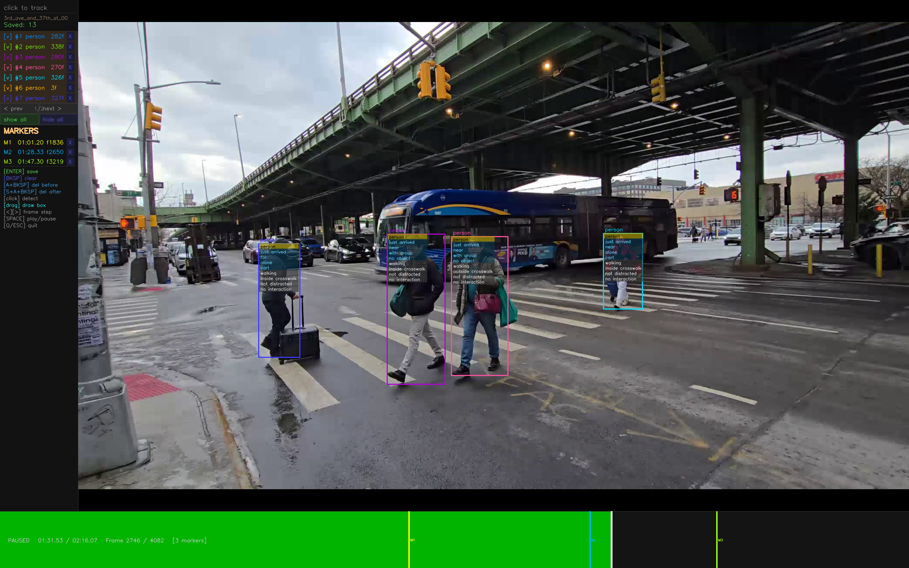

# OpenCV Video Labelling Tool

A fullscreen, keyboard-driven video annotation tool for labelling pedestrians and vehicles frame-by-frame. Built on OpenCV, YOLO v11, and BotSort tracking.



---

## Features

- **YOLO + BotSort tracking** — click any detected object to lock onto it; tracks automatically across frames during playback
- **Manual bounding box drawing** — drag to draw a box when YOLO misses an object
- **Frame-by-frame annotation popup** — click a tracked box while paused to cycle per-frame and per-track states
- **Per-track vs per-frame states** — per-track changes propagate to every frame in the track; per-frame changes apply only to the current frame
- **Linear box interpolation** — boxes between two manually-keyed frames are interpolated automatically on save
- **Annotation overlay** — colour-coded (teal = mode, amber = per-track, grey = per-frame) translucent overlay on every box
- **Named timeline markers** — press `M` to drop a named marker; markers appear as coloured ticks on the timeline and are persisted to JSON
- **Saved-track sidebar** — review, preview-toggle, and delete saved tracks per page; show/hide all with one click
- **JSON persistence** — tracks and markers are saved to `<video>_tracks.json` alongside the video; loaded automatically on next launch, seeking to the first marker
- **Trim / scrub controls** — scrub frame-by-frame, delete frames before/after the cursor, or clear the whole unsaved track

---

## Requirements

- Python 3.10+
- Windows (uses `ctypes` / `GetAsyncKeyState` for DPI awareness and modifier-key detection)

---

## Installation

```bash
git clone https://github.com/abhishekk962/opencv-labelling-tool.git
cd opencv-labelling-tool
python -m venv .venv
.venv\Scripts\activate        # Windows
pip install -r requirements.txt
```

The YOLO model weights (`yolo11n.pt`) are downloaded automatically by `ultralytics` on first run.

---

## Usage

```bash
python main.py path/to/video.mp4
```

---

## Controls

### Playback

| Key / Action | Effect |
|---|---|
| `Space` | Play / Pause |
| `←` / `→` | Step one frame backward / forward |
| Click timeline | Seek to that position |
| `Q` / `Esc` | Quit |

### Tracking

| Key / Action | Effect |
|---|---|
| Click object | Detect with YOLO+BotSort and lock onto that object |
| Drag on video | Draw a manual bounding box |
| Click tracked box (paused) | Open annotation popup |
| Click popup row | Cycle that state to the next option |

### Track management

| Key / Action | Effect |
|---|---|
| `Enter` | Save current track to JSON |
| `Backspace` | Clear the current unsaved track |
| `Alt + Backspace` | Delete all history frames **before** the current frame |
| `Shift + Alt + Backspace` | Delete all history frames **after** the current frame |

### Markers

| Key | Effect |
|---|---|
| `M` | Add a named marker at the current frame |
| Click `[X]` in sidebar | Delete a marker |

---

## Customising annotation categories

Edit `TRACK_STATES` near the top of `main.py`:

```python
TRACK_STATES = {
    'person': [
        ('movement', ['walking', 'waiting', 'rushing'], 'per_frame'),
        ('group size', ['alone', 'with group'],          'per_track'),
        # add more rows here …
    ],
    'vehicle': [
        ('movement', ['turning', 'waiting', 'straight'], 'per_frame'),
        # …
    ],
}
```

- `'per_frame'` — stored individually for each frame; editable on every paused frame
- `'per_track'`  — set once; changing it retroactively updates all frames in the track

To map additional YOLO classes to a mode, edit `YOLO_CLASS_MAP`:

```python
YOLO_CLASS_MAP = {
    'person':     'person',
    'car':        'vehicle',
    'truck':      'vehicle',
    'bicycle':    'vehicle',   # ← add new mappings here
}
```

---

## Output format

Saved to `<video-name>_tracks.json`:

```json
{
  "tracks": [
    {
      "saved_at": "2026-03-05T12:00:00",
      "mode": "person",
      "track_states": { "wait time": "short wait", "group size": "alone" },
      "video_file": "/path/to/video.mp4",
      "frame_count": 42,
      "frames": [
        {
          "frame_num": 100,
          "time_sec": 3.3333,
          "box": [x1, y1, x2, y2],
          "label": "person",
          "mode": "person",
          "states": { "movement": "walking", "crosswalk position": "inside crosswalk" }
        }
      ]
    }
  ],
  "markers": [
    { "label": "M1", "frame": 100 }
  ]
}
```

`track_states` holds the per-track values; each frame's `states` object holds only per-frame values. To reconstruct the full state for any frame, merge `track_states` (base) with `frames[i].states` (override).

---

## License

See [LICENSE](LICENSE) for details.
